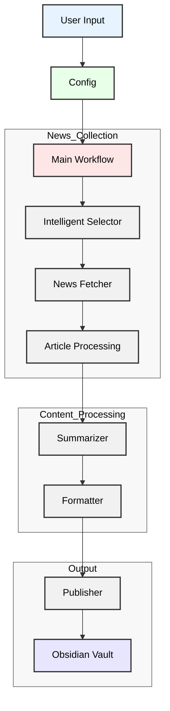

# Obsidian News Digest

An intelligent news aggregation and summarization tool that automatically creates daily news digests in your Obsidian vault. This application uses an agent to fetch, analyze, and summarize news articles based on your preferences.

## Features

- 🤖 **Article Selection**: Uses an agent to select the most relevant news articles based on your preferences
- 📰 **Multiple News Sources**: Supports various news sources and can be configured to your preferred outlets
- 📝 **Summaries**: Generates concise, informative summaries of news articles
- 📂 **Obsidian Integration**: Automatically publishes digests to your Obsidian vault
- ⚙️ **Customizable Preferences**: Configure topics, keywords, and source preferences
- 🔄 **Daily Updates**: Creates fresh news digests with the latest information

## Prerequisites

- Python 3.8 or higher
- An OpenAI API key
- An Obsidian vault
- Required Python packages (see `requirements.txt`)

## Configuration

The application can be configured through  `config.py`. 
Key configuration options include:

- News sources
- Maximum number of articles
- Output folder in Obsidian
- News preferences (topics, keywords, geographic focus)
- Intelligent selection settings

## Project Components

- `main.py`: Main entry point and workflow orchestration
- `config.py`: Configuration management
- `news_fetcher.py`: News article fetching functionality
- `summarizer.py`: Article summarization using AI
- `formatter.py`: Digest formatting and markdown generation
- `publisher.py`: Obsidian vault integration
- `intelligent_selector.py`: AI-powered article selection

## Application Architecture

The diagram above illustrates the flow of data through the application:

1. **User Input & Configuration**: The process starts with user preferences and configuration settings
2. **News Collection**: 
   - Intelligent Selector determines relevant articles
   - News Fetcher retrieves the articles
   - Article Processing prepares the content
3. **Content Processing**:
   - Summarizer creates concise summaries
   - Formatter structures the content
4. **Output**:
   - Publisher handles the final integration
   - Content is saved to the Obsidian Vault

